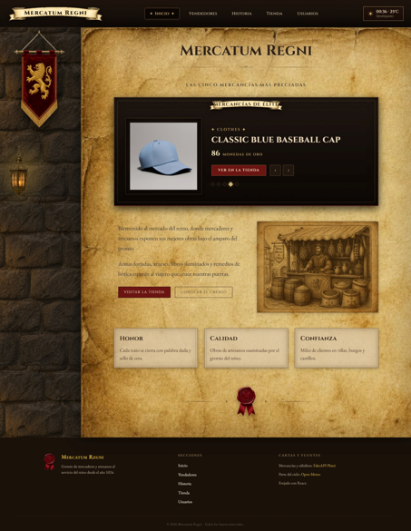
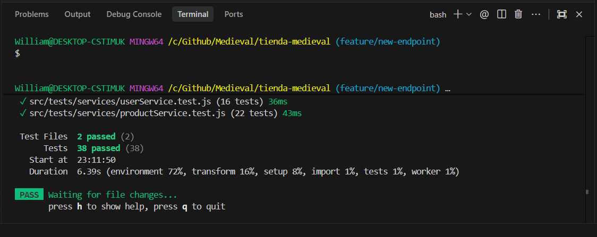

# ⚔️ Mercatum Regni — Tienda Medieval en Línea 🛡️



Proyecto desarrollado para el **Bootcamp**, consistente en una plataforma e-commerce inmersiva con temática **Medieval**. **Mercatum Regni** es el gremio virtual donde mercaderes y artesanos exponen sus mercancías más preciadas desde 1024.

---

## 📌 Enlaces del Proyecto (Entregables)

- 🎨 **Diseño en Lovable:** [Enlace público a Lovable (Modo Lectura)](https://arcane-merchant-script.lovable.app/)
- 🚀 **Despliegue en Vercel:** [Mercatum Regni en Vercel](https://tienda-medieval.vercel.app/)
- 📦 **Repositorio GitHub:** [GitHub Repository](https://github.com/mxu-init/tienda-medieval.git)

---

## 📜 Descripción del Proyecto

El proyecto sigue una arquitectura web moderna con **React** y **Vite**, complementada con una experiencia visual basada en pergaminos envejecidos, muros de piedra, faroles de latón, estandartes reales y sellos de cera.

### 🎯 Requisitos del Bootcamp Fulfillments

1. **Diseño Aceptado por el Cliente:** Maquetado conceptual y prototipado en Figma.
2. **Estética Medieval Sorteada:** Paleta de colores cálidos, pergaminos, texturas y tipografías clásicas (`Cinzel` y `EB Garamond`).
3. **Estructura Estándar:** Cada página cuenta con un **Header** unificado, contenido principal (**Main**) y un **Footer**.
4. **Header Interactivo con Clima:** Widget en tiempo real que consume la API del clima para mostrar la temperatura y el estado del tiempo actual.
5. **Capa de Servicios y Pruebas Unitarias:** Capa de servicios aislada para la API de Supabase y suite completa de pruebas unitarias automatizadas con **Vitest** y **Testing Library**.
6. **Buenas Prácticas de Git:** Uso riguroso de **Conventional Commits** y **Conventional Branches**.
7. **Gestión Ágil:** Pesaje de tareas e historias de usuario en **Jira**.
8. **Despliegue:** Integración continua y hosting en **Vercel**.

---

## ✨ Funcionalidades y Páginas

1. 🏰 **Portal Principal de Bienvenida (Home):**
   - **Banner Dinámico Interactivo:** Consulta y calcula las mercancías de mayor valor/precio en tiempo real consumiendo la API de productos.
   - **Presentación del Reino & Virtudes Gremiales:** Sección descriptiva (*Honor*, *Calidad*, *Confianza*) sobre pergamino con marco ornamental.
2. 🛍️ **Vitrina de Productos:**
   - Catálogo de artículos disponibles en el mercado.
   - Operaciones **CRUD** completas para listar, crear, editar y eliminar productos.
3. 👥 **Información de los Vendedores:**
   - Sección dedicada al gremio de artesanos con imágenes, nombres y especialidades.
4. 📖 **Historia de la Tienda:**
   - Relato temático inventado sobre los orígenes de *Mercatum Regni* desde el año 1024.
5. 👤 **Gestión de Usuarios:**
   - Listado y panel de administración de usuarios registrados.
   - Operaciones **CRUD** completas para la gestión de usuarios.

---

## 🛠️ Stack Tecnológico & APIs

- **Core:** React 19, HTML5, JavaScript (ES6+).
- **Tooling & Bundler:** Vite 8.
- **Testing:** Vitest 5, JSDOM, React Testing Library, `@testing-library/jest-dom`.
- **Enrutamiento:** React Router DOM v7.
- **HTTP Client:** Axios.
- **Base de Datos & Auth:** Supabase REST API (PostgREST / Row Level Security).
- **Estilos:** Custom CSS / Vanilla CSS con variables HSL/OKLCH, tipografías de Google Fonts (`Cinzel`, `EB Garamond`), texturas realistas en JPG/PNG y microanimaciones.
- **APIs Consumidas:**
  - 🛒 **Productos & Categorías:** Supabase REST API (`/rest/v1/products`, `/rest/v1/categories`)
  - 👤 **Usuarios:** Supabase REST API (`/rest/v1/users`)
  - 🌤️ **Clima en tiempo real:** [Open-Meteo Weather API](https://open-meteo.com/en/docs)

---

## 🧪 Pruebas Unitarias & Cobertura (Testing)

El proyecto cuenta con una suite completa de unit tests aislados e instantáneos para la capa de servicios (`src/services/`), garantizando la correcta comunicación HTTP, la transformación de datos y el manejo de errores sin depender de conexiones a la red ni a Supabase.

### 🏛️ Arquitectura de Pruebas (`src/tests/`)
- **`src/tests/setupTests.js`**: Configuración global de matchers personalizados con `@testing-library/jest-dom`.
- **`src/tests/mocks/mockData.js`**: Fixtures centralizadas con datos temáticos del reino (categorías, productos y usuarios).
- **`src/tests/services/productService.test.js`**: Suite de pruebas para `productService.js`.
- **`src/tests/services/userService.test.js`**: Suite de pruebas para `userService.js`.

### 🛡️ Estrategia y Cobertura de Tests
1. **Mocking de Axios:** Intercepción aislada de la instancia central Axios (`src/services/api.js`) mediante `vi.mock` (`api.get`, `api.post`, `api.patch`, `api.delete`).
2. **Normalización de Payloads:** Verificación de conversión automática de campos camelCase a snake_case (por ejemplo `categoryId` a `category_id`) en `createProduct` y `updateProduct`.
3. **Manejo de Errores y RLS (Row Level Security):** Validación de lanzamiento de excepciones personalizadas ante fallos de red o respuestas vacías (`[]`) provocadas por restricciones de permisos en Supabase.
4. **Manejo de Cancelación de Peticiones:** Verificación de relanzamiento limpio de errores de aborto (`CanceledError` y `AbortError`).
5. **Aislamiento Total:** Limpieza de historial de mocks (`vi.clearAllMocks()`) en cada bloque `beforeEach`.

### 🚀 Instrucciones para Ejecutar los Tests

[](https://github.com/mxu-init/tienda-medieval/actions/workflows/test.yml)



- **Ejecutar tests en modo de observación (Watch Mode):**
  ```bash
  npm test
  ```

- **Ejecutar todos los tests una sola vez (Single Run):**
  ```bash
  npx vitest run
  ```

- **Ejecutar tests con interfaz gráfica interactiva (UI Mode):**
  ```bash
  npx vitest --ui
  ```

- **Generar informe de cobertura de código (Coverage):**
  ```bash
  npx vitest run --coverage
  ```

---

## 📁 Estructura del Proyecto

```text
tienda-medieval/
├── public/
│   ├── favicon.svg
│   └── icons.svg
├── src/
│   ├── assets/
│   │   └── img/           # Imágenes y texturas (stone.jpg, parchment.jpg, banner.png, lantern.png, seal.png, market.jpg)
│   ├── components/
│   │   ├── Banner/        # Componente de Banner dinámico (mercancías más valiosas)
│   │   ├── Header/        # Componente Header (Navegación + Widget del clima)
│   │   ├── ProductForm/   # Formulario de creación/edición de mercancías
│   │   ├── ProductModal/  # Modal de gestión de productos
│   │   ├── SalespersonCard/ # Tarjetas de artesanos y vendedores
│   │   └── UserModal/     # Modal de gestión de usuarios
│   ├── data/              # Constantes y datos auxiliares
│   ├── pages/
│   │   ├── home/          # Página de inicio Mercatum Regni (Home.jsx & Home.css)
│   │   ├── products/      # Página de productos (Products.jsx & Products.css)
│   │   ├── sellers/       # Página de vendedores (Sellers.jsx & Sellers.css)
│   │   ├── story/         # Página de historia del reino (Story.jsx & Story.css)
│   │   └── users/         # Panel de gestión de usuarios (Users.jsx & Users.css)
│   ├── services/
│   │   ├── api.js         # Instancia Axios centralizada con interceptores JWT
│   │   ├── productService.js # Servicio de productos y categorías (Supabase REST)
│   │   ├── userService.js    # Servicio de usuarios (Supabase REST)
│   │   └── WeatherServices.jsx # Integración API Clima (Open-Meteo)
│   ├── tests/
│   │   ├── mocks/
│   │   │   └── mockData.js   # Fixtures de prueba centralizadas
│   │   ├── services/
│   │   │   ├── productService.test.js # Tests unitarios de productos
│   │   │   └── userService.test.js    # Tests unitarios de usuarios
│   │   └── setupTests.js     # Setup global de Testing Library / jest-dom
│   ├── App.jsx            # Enrutador principal de la aplicación
│   ├── App.css
│   ├── index.css
│   └── main.jsx
├── eslint.config.js
├── index.html
├── package.json
├── vite.config.js
└── README.md
```

---

## ⏱️ Planificación por Sprints

- 🚀 **Sprint 1 (Viernes 28 de Agosto):**
  - Configuración inicial del repositorio React + Vite.
  - Maquetación del prototipo medieval en Lovable.
  - Implementación del Banner dinámico y diseño de la página de Inicio (Home).
  - Integración del Widget de Clima en tiempo real en el Header.
  - Estructura base de Header, Main y Footer.
  - Planificación de tareas en Jira.
  - Despliegue en Vercel.

- 🏁 **Sprint 2 y Entrega Final (Viernes 4 de Septiembre):**
  - Desarrollo completo del CRUD de Productos y Usuarios integrado a Supabase REST API.
  - Implementación de la Capa de Servicios (`api.js`, `productService.js`, `userService.js`).
  - Configuración del Entorno de Pruebas con Vitest, JSDOM y React Testing Library.
  - Desarrollo de suites de pruebas unitarias con interceptores de Axios y validación de RLS.
  - Finalización de las páginas de Vendedores e Historia.
  - Auditoría de Clean Code y validación de entregables.

---

## ⚙️ Instalación y Ejecución Local

Para ejecutar el proyecto en tu entorno local, sigue estos pasos:

1. **Clonar el repositorio:**
   ```bash
   git clone https://github.com/mxu-init/tienda-medieval.git
   cd tienda-medieval
   ```

2. **Instalar dependencias:**
   ```bash
   npm install
   ```

3. **Iniciar el servidor de desarrollo:**
   ```bash
   npm run dev
   ```

4. **Ejecutar la suite de pruebas:**
   ```bash
   npm test
   ```

5. **Compilar para producción:**
   ```bash
   npm run build
   ```

---

## 🤝 Convenciones y Calidad de Código

- **Conventional Commits:** `feature:`, `fix:`, `docs:`, `style:`, `test:`.
- **Conventional Branches:** `feature/nombre-funcionalidad`, `fix/nombre-bug`, `test/nombre-test`.
- **Clean Code & Unit Testing:** Componentes modulares, separación de responsabilidades y tests unitarios aislados.

---

## 👥 Integrantes del Proyecto

<a href="https://github.com/mxu-init/tienda-medieval/graphs/contributors">
  
</a>
 

 
| Nombre | GitHub |
| :--- | :--- |
| **Mauricio Rodríguez** | [@mxu-init](https://github.com/mxu-init) |
| **William Hernández** | [@wfhgdev](https://github.com/wfhgdev) |
| **Kanstantsin Mlechka** | [@kvadrakola](https://github.com/kvadrakola) |
| **Óscar Pérez** | [@oscarperezGR](https://github.com/oscarperezGR) |
| **Marisa Ruiz** | [@Marisa-Ruiz](https://github.com/Marisa-Ruiz) |
